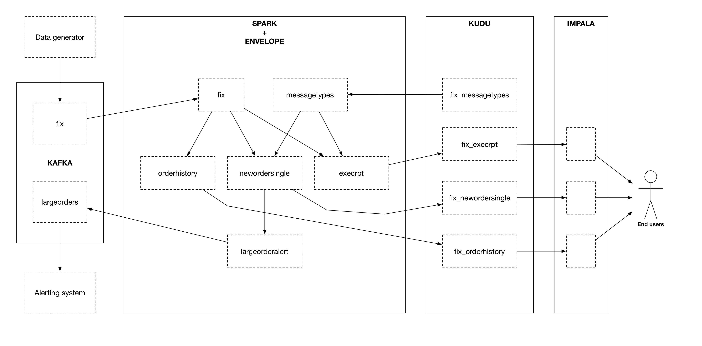

# FIX example

The FIX example is an Envelope pipeline that receives https://en.wikipedia.org/wiki/Financial_Information_eXchange[FIX financial messages] of order fulfillment (new orders and execution reports), updates the representation of the order in Apache Kudu, and sends alerts of outliers to Apache Kafka. This use case would allow near-real-time analytics of order history.

The configuration for this example is found link:fix.conf[here]. The messages do not fully conform to the real FIX protocol but should be sufficient to demonstrate how a complete implementation could be developed.

## Running the example

. Modify `create_fix_tables.sql`, `fix.conf`, and `fix_generator.conf` to point to your cluster. If your cluster has secured Kafka, you will also need to modify the configuration files and below `spark2-submit` calls (see the FIX HBase example for more details) and the `kafka-topics` and `kafka-console-consumer` calls (see the test steps in the link:https://www.cloudera.com/documentation/kafka/latest/topics/kafka_security.html#concept_lcn_4mm_s5[Cloudera Kafka documentation] for more details).

. Create the required Kudu tables using the provided Apache Impala script:

    impala-shell -f create_fix_tables.sql

. Create the required Kafka topics:

    kafka-topics --zookeeper YOURZOOKEEPERHOSTNAME:2181 --create --topic fix --partitions 4 --replication-factor 3
    kafka-topics --zookeeper YOURZOOKEEPERHOSTNAME:2181 --create --topic largeorders --partitions 4 --replication-factor 3

. Run the example by submitting the Envelope application with the example's configuration:

    SPARK_KAFKA_VERSION=0.10 spark2-submit envelope-*.jar fix.conf

. In another terminal session start the data generator, which is itself an Envelope pipeline that writes out one million example orders to Kafka:

    spark2-submit envelope-*.jar fix_generator.conf

. View the arriving large order alerts by running the Kafka console consumer:

    kafka-console-consumer --zookeeper YOURZOOKEEPERHOSTNAME:2181 --topic largeorders

. View the order history by querying the Kudu tables through Impala, for example:

  [impalad:21000] > SELECT
                  >     orderqty
                  >   , leavesqty
                  >   , CAST(CAST(startdate AS DECIMAL(15,0)) / 1000 AS TIMESTAMP) startdate
                  >   , CAST(CAST(enddate AS DECIMAL(15,0)) / 1000 AS TIMESTAMP) enddate
                  >   , currentflag
                  > FROM fix_orderhistory
                  > WHERE clordid = '0000146c-940e-491d-aea4-c2211023faab'
                  > ORDER BY startdate;
  +----------+-----------+-------------------------------+-------------------------------+-------------+
  | orderqty | leavesqty | startdate                     | enddate                       | currentflag |
  +----------+-----------+-------------------------------+-------------------------------+-------------+
  | 9662     | 9662      | 2017-04-03 20:28:16.225000000 | 2017-04-03 20:28:16.233000000 | N           |
  | 9662     | 7476      | 2017-04-03 20:28:16.234000000 | 2017-04-03 20:28:16.238000000 | N           |
  | 9662     | 6601      | 2017-04-03 20:28:16.239000000 | 2017-04-03 20:28:16.242000000 | N           |
  | 9662     | 6170      | 2017-04-03 20:28:16.243000000 | 2017-04-03 20:28:16.246000000 | N           |
  | 9662     | 4994      | 2017-04-03 20:28:16.247000000 | 2017-04-03 20:28:16.252000000 | N           |
  | 9662     | 4207      | 2017-04-03 20:28:16.253000000 | 2017-04-03 20:28:16.254000000 | N           |
  | 9662     | 2107      | 2017-04-03 20:28:16.255000000 | 2017-04-03 20:28:16.263000000 | N           |
  | 9662     | 1296      | 2017-04-03 20:28:16.264000000 | 2017-04-03 20:28:16.272000000 | N           |
  | 9662     | 0         | 2017-04-03 20:28:16.273000000 | 9999-12-31 00:00:00           | Y           |
  +----------+-----------+-------------------------------+-------------------------------+-------------+

[NOTE]
The CAST logic is used as a workaround until Kudu supports the TIMESTAMP type. This logic could be wrapped in an Impala view so that users do not need to write it themselves.

## Requirements

This example aims to solve the following requirements:

1. Receive FIX messages that are provided by a Kafka topic. The messages contain new orders and execution reports, where each execution report of an order fulfills some or all of the remaining quantity of the order.
2. Append an English description of the 'msgtype' code field.
3. Rename the FIX tags (e.g. 38) to the equivalent FIX names (e.g. 'orderqty').
4. Make the new orders and execution reports available for end user query.
5. Make the history of the orders available for end user query, and in a model that the state of the order at any point in time can be easily retrieved.
6. Detect orders with a large quantity (i.e. quantity = 9999) and send those to another Kafka topic.
7. Messages must be processed end-to-end within typical human response time, i.e. a few seconds.

## Why use a Cloudera EDH?
The requirements are very well suited to a Cloudera EDH based solution because the platform contains all the components we need to do the ETL and querying, and which are all distributed for very high scalability:

- Apache Kafka for receiving the messages, and sending back the large orders
- Apache Spark for processing the messages
- Apache Kudu for storing the processed messages for querying
- Apache Impala for querying the processed messages in Kudu

The Kafka->Spark->Kudu->Impala data flow makes up a powerful architecture for many streaming use cases.

## Why use Envelope?
The requirements are very well suited to Envelope for building out the Spark application:

- Envelope can read from Kafka topics
- Envelope can run in streaming mode using Spark Streaming, which enables end-to-end latency in the low seconds
- Envelope can join streams to Kudu tables
- Envelope can run simple transformations using Spark SQL, including on streams
[NOTE]
Envelope can run more complex transformations with user-provided DataFrame-based code, but that is not required in this example.
- Envelope can write processed data to Kudu tables and to Kafka topics
- Envelope can automatically track the history of records over time

Best of all, Envelope can implement all of the requirements without a single line of user-provided code.

## Walkthrough

The walkthrough is a discussion of the FIX Envelope pipeline that goes over how it works and why it was built in this particular way. By getting a feel for the thought process behind this example it is intended that the reader can more successfully build out other applications on Envelope.

For reference:

- The Envelope configuration of the FIX example application is found link:fix.conf[here].
- The Envelope configuration of the FIX data generator is found link:fix_generator.conf[here].
- The Impala/Kudu data model of the FIX example application is found link:create_fix_tables.sql[here].

### Architecture

The high-level architecture of the example is to stream the FIX messages in from Kafka, process them with Spark, and write some of the processed records to Kudu for querying by Impala and some of the processed records to Kafka for consumption by downstream systems. Envelope is used to more easily build the Spark processing, in terms of productivity and aligning with best practices. This streaming architecture allows for complex transformations at high scale and low latency. All of these components are provided as part of a Cloudera EDH and so are highly integrated and tested together.

Using Kafka for the incoming FIX stream and outgoing large order alerts provides a strong encapsulation of the application to the interacting systems. The upstream source of FIX messages simply needs to push new messages on to the `fix` topic, which in this application is treated as a massively scalable queue of messages to be processed. The downstream consumer of large order alerts simply needs to pull messages being put on to the `largeorders` topic. There is no coupling of external systems to the internal component architecture beyond Kafka. This principle works very well for this example, and for many other applications, even those that may interact in a bursty or batch mode.

Using Spark for processing the raw upstream messages provides the application with the ability to define complex transformation graphs, scale to high incoming message velocities, and to be fault tolerant across many failure scenarios. Spark's DataFrame API allows structured data to be processed efficiently and where the processing can be expressed in familiar terms, such as SQL. For the FIX example Spark can define all of the processing required as Spark SQL queries, and can scale up to very high velocities of incoming FIX messages.

Using Envelope provides the application developer the opportunity to minimize the coding necessary to implement a Spark processing pipeline. Envelope is driven by configuration, with the intention that the only code that developers may need to include is for defining complex business rules. In the case of the FIX example there is a graph of processing that interacts with both Kafka and Kudu as an input and an output, that runs SQL queries to define how to process the FIX messages, and that manages a slowly changing dimension, all without any additional code.

Using Kudu for persistent storage is the key to the application being able to efficiently update the state of the orders in a continuous streaming fashion while still enabling end users to do heavy analytics queries over the same data at high performance. With Kudu being able to do both at once the storage architecture of the application is drastically simpler than it would otherwise be, where perhaps the stream of updates would go into HBase and periodic extracts would go into HDFS, which leads to heavy ETL complexity and large delays on end user availability to live data. In the FIX example there are three tables being written to each micro-batch, and a fourth table of small reference data that is read in to contribute to the processing.

Using Impala for end user querying exposes a familiar SQL interface to the state of the application, and at high query performance, including under heavy concurrency. Impala is integrated with Kudu so that the queryable data looks just like any other table, and so that many query predicates can be pushed down into Kudu to reduce I/O. The speed and standard JDBC/ODBC interfaces of Impala makes it an obvious choice for connecting with most well established industry BI tools, which means that the application can be quickly set up to be accessible by a whole community of end users. In the FIX example the end users can query Impala to get the latest trade order information, which may have occurred just seconds earlier, and also the deep history of all processed messages, which could have spanned years, and all at the same non-aggregated granularity. Rolling up and slicing/dicing the Kudu data can be very efficiently run by Impala using standard SQL.

### Data model

The data model of the application is defined using Kafka topics for interacting with external systems, and Impala/Kudu tables for interacting with end users.

#### Kafka topics

In the FIX example there are two topics:

- `fix` is used for the upstream source (the data generator) to write the raw FIX messages and for the Spark/Envelope pipeline to read for processing. The FIX messages can either be for new orders or for executions on an order. The number of partitions for the topic should ideally be at least as many as there are cores in the Spark job (#executors x #cores per executor) so that all cores are participating in the processing. If there are less partitions than cores then the stream can be repartitioned, but this will have a performance impact. The replication factor should be at least 3 so that the Kafka topic is resilient to the failure of a Kafka broker.

- `largeorders` is used for the downstream alerting system (the Kafka console consumer) to read the processed order records that are considered 'large'. The number of partitions for the topic is less important than for the `fix` topic because the volume is expected to be much smaller, although it could hypothetically need to scale to handle sudden bursts of large orders. The replication factor of at least 3 remains important for all topics.

#### Impala/Kudu tables

In the FIX example there are four Impala/Kudu tables:

- `fix_messagetypes`

----
DROP TABLE IF EXISTS fix_messagetypes;
CREATE TABLE fix_messagetypes
(
    msgtype STRING
  , msgtypedesc STRING
  , PRIMARY KEY (msgtype)
)
PARTITION BY HASH(msgtype) PARTITIONS 2
STORED AS KUDU;
INSERT INTO fix_messagetypes VALUES ('D', 'Order Single'), ('8', 'Execution Report');
----

This table is an input of the Spark processing, and contains a mapping of FIX message type codes to English descriptions. It is included in the example to demonstrate a lookup table that can be joined to for enrichment. The table is stored in Kudu, which would allow it to be easily updated. It could alternatively be stored in HDFS, although updates to HDFS tables require an overwrite of the full table (or partition), which may be difficult to manage in a larger table. The two columns are strings so they use the STRING data type, and the primary key that enforces unique identification of records is the message type code (`msgtype`). The Kudu table is hash-partitioned on the primary key into just two buckets because the table only contains two records and does not need more than the minimum number of tablets. The data of the table is loaded at deployment time with a simple INSERT VALUES statement.

- `fix_newordersingle`

----
DROP TABLE IF EXISTS fix_newordersingle;
CREATE TABLE fix_newordersingle
(
    clordid STRING
  , msgtype STRING
  , msgtypedesc STRING
  , handlinst INT
  , `symbol` STRING
  , side INT
  , transacttime BIGINT
  , ordtype INT
  , orderqty INT
  , checksum STRING
  , PRIMARY KEY (clordid)
)
PARTITION BY HASH(clordid) PARTITIONS 4
STORED AS KUDU;
----

This table is an output of the Spark processing, and contains all the processed new order records from the FIX messages. The table is stored in Kudu so that it can be continuously written to by the Spark job and also queried at high speed by end users interacting with Impala. An order is identified by the `clordid` so that is used as the primary key. The `symbol` field is enclosed in backquotes because that is otherwise a reserved keyword of Impala.

The number of hash partitions is set to 4 as a rough correspondence with the number of cores of the job, but this is purely an example. For determining the optimal number of partitions for this example on your cluster, or for other applications, see the https://www.cloudera.com/documentation/kudu/latest/topics/kudu_schema_design.html#concept_zxq_wry_1z[Impala/Kudu schema design] documentation.

- `fix_execrpt`

----
DROP TABLE IF EXISTS fix_execrpt;
CREATE TABLE fix_execrpt
(
    execid STRING
  , msgtype STRING
  , msgtypedesc STRING
  , orderid STRING
  , clordid STRING
  , exectranstype INT
  , exectype INT
  , ordstatus INT
  , `symbol` STRING
  , side INT
  , leavesqty INT
  , cumqty INT
  , avgpx DOUBLE
  , transacttime BIGINT
  , checksum STRING
  , lastupdated STRING
  , PRIMARY KEY (execid)
)
PARTITION BY HASH(execid) PARTITIONS 4
STORED AS KUDU;
----

This table is an output of the Spark processing, and contains all the processed execution report records from the FIX messages. The table follows a similar design process to the `fix_newordersingle` table.

- `fix_orderhistory`

----
DROP TABLE IF EXISTS fix_orderhistory;
CREATE TABLE fix_orderhistory
(
    clordid STRING
  , startdate BIGINT
  , `symbol` STRING
  , transacttime BIGINT
  , orderqty INT
  , leavesqty INT
  , cumqty INT
  , avgpx DOUBLE
  , enddate BIGINT
  , currentflag STRING
  , lastupdated STRING
  , PRIMARY KEY (clordid, startdate)
)
PARTITION BY HASH(clordid, startdate) PARTITIONS 4
STORED AS KUDU;
----

This table is an output of the Spark processing, and contains the history of partially and fully completed orders from the FIX messages. A completed order consists of a new order message and one to many execution report messages, where the execution reports fulfill the quantity requested by the new order. As the state of the order changes, i.e. it is created and then over time fulfilled, this table keeps a record per state. Because there are multiple records per order the primary key is set to the order identifier (`clordid`) plus the effective-from timestamp for when the state became active (`startdate`) to ensure unique identification of each order state.

The range of time (real world/event time, not Envelope/system time) that each state was active/effective/current for is captured by the `startdate` and `enddate` columns. The latest state of each order is conveniently expressed by the `currentflag` column having the value `Y`, otherwise `N`. These metadata fields allow the latest and historical states of the order to be easily and efficiently queried with just filters. Without these fields the end user queries would have to resort to complex and slow aggregation queries to find the desired record of each order. This modeling technique is known as a Type 2 slowly changing dimension. One of the major benefits of using Envelope is that it will automatically manage the different records, and metadata columns on each record, of a natural key (here the `clordid`). Without Envelope this complex logic would need to be coded from scratch.

### Configuration

#### Application section
The configuration begins with an `application` section:

----
application {
  name = FIX Envelope example
  batch.milliseconds = 5000
  executor {
    instances = 1
    cores = 4
    memory = 4G
  }
}
----

[TIP]
In the HOCON format the 'sections' are just a simple way to specify the same prefix for a subset of configurations.

These configurations let us configure the Spark application, which in the Spark API is the `SparkConf` used to create the `JavaSparkContext`. The section can be left out altogether if just using the defaults.

We specify the name so that YARN will show that the application is running the FIX example.

We specify a micro-batch duration of 5 seconds, and a single executor with 4 cores and 4GB of memory, but purely as an example. For a real application these should be determined based on benchmarking and requirements.

#### Steps
The configuration then contains the steps of the pipeline:

----
steps {
  fix {
    ...
  }

  messagetypes {
    ...
  }

  newordersingle {
    dependencies = [fix, messagetypes]
    ...
  }

  execrpt {
    dependencies = [fix, messagetypes]
    ...
  }

  orderhistory {
    dependencies = [fix]
    ...
  }

  largeorderalert {
    dependencies = [newordersingle]
    ...
  }
}
----

At a high level the steps represent the data flowing through the pipeline. Within Spark each step maps to a  DataFrame.

The data for each step can either come from an external input (e.g. Kafka for `fix` and Kudu for `messagetypes`) or a derivation of one or more other steps (e.g. SQL queries for `newordersingle`, `execrpt`, `orderhistory`, `largeorderalert`).

The data for each step can also be written out to an external output (e.g. Kudu for `newordersingle`, `execrpt`, `orderhistory`, and Kafka for `largeorderalert`).

Each step can also define which steps it is dependent on. This allows Envelope to run the pipeline in the correct order and to parallelize steps that are independent.

#### Step `fix`
----
fix {
  input {
    type = kafka
    brokers = "REPLACEME:9092"
    topics = [fix]
    encoding = string
    translator {
      type = kvp
      delimiter.kvp = "\u0001"
      delimiter.field = "="
      field.names = [6,10,11,14,17,20,21,35,37,38,39,40,54,55,60,150,151]
      field.types = [double,string,string,int,string,int,int,string,string,int,int,int,int,string,long,int,int]
    }
  }
}
----

In this step we read in the source FIX messages from Kafka.

The `fix` step contains only an `input` section. This means that it only reads in data from an external input and makes it available as a DataFrame for subsequent steps.

[TIP]
When an Envelope pipeline contains at least one streaming input (such as Kafka) then the entire pipeline will run in Spark Streaming mode, and the steps will be repeated for each micro-batch. Pipelines that do not have any streaming inputs will run as a 'normal' Spark application that executes the steps once and then exits.

##### Input

The first configuration of the input is the `type`. This defines which input implementation to use. Envelope provides not only an API for implementing inputs (and other pluggable points) but also some widely useful implementations, such as for Kafka and Kudu. By specifying `kafka` for the `type` Envelope knows to use its provided Kafka input.

[TIP]
User-provided inputs (and other pluggable points such as derivers, planners, and outputs) can be specified with the fully qualified name of the implementing class.

`brokers` lists out the Kafka brokers to connect to. Replace `REPLACEME` with your Kafka broker hostname. If you have multiple Kafka brokers you can provide a comma-separated list of `host:port`.

`topics` lists out the Kafka topics to read from. In most cases this would just be a single topic. In this example we use the topic name `fix`.

`encoding` tells Envelope which data type to use to read the Kafka messages. In this example we do not have binary data so we can use `string`. The encoding needs to match the expected encoding of the translator.

##### Translator

The `translator` section defines how the Kafka messages (where a message is just a single string) can be translated to DataFrame rows (where a row has fields with names and types).

The `type` specifies which translator implementation to use. FIX messages are structured as multiple key-value pairs within a single message, so we can specify `kvp` to use the provided KVP translator.

[TIP]
User-provided translators can be specified with the fully qualified name of the translator class, which must implement the Translator interface.

`delimiter.kvp` specifies the delimiter string that separates each of the key-value pairs on the message. FIX messages use the non-printing ASCII 1 character, so we use the Unicode escape sequence `\u0001` as the key-value pair delimiter.

`delimiter.field` specifies the delimiter string that separates the key and value of a single key-value pair. FIX messages use the equals sign character, so we just provide that in quotes.

`field.names` specifies the keys of the key-value pairs that we want to read from the messages. These become the field names of the DataFrame for the step. These do not need to match the order of the keys on the message, and do not need to read every key of the message. FIX messages use numeric 'tags' for its keys so we provide the ones that we will be using in the example.

`field.types` specifies the data types of the values for the key-value pairs that we want to read from the messages. These become the field types of the DataFrame for the step. The list must match the order of `field.names`. We specify the data types for the fields that we are reading from the FIX messages.

#### Step `messagetypes`

----
messagetypes {
  input {
    type = kudu
    connection = "REPLACEME:7051"
    table.name = "impala::default.fix_messagetypes"
    hint.small = true
  }
}
----

In this step we read in the English descriptions for the `msgtype` field codes. The descriptions are stored in a Kudu table. We will join this to the stream in subsequent steps.

Again this step only contains an `input` section.

##### Input

For `type` we specify `kudu` because we are reading the descriptions from Kudu.

`connection` specifies the Kudu masters to connect to. Replace `REPLACEME` with the comma-separated list of `host:port` values for your Kudu masters.

`table.name` is the Kudu table name to read from.
[WARNING]
Kudu tables created from Impala have the naming convention `impala::[impala database name].[impala table name]`.

`hint.small` tells Spark to consider the step's DataFrame as small enough for broadcasting in a broadcast join. The descriptions are very small so we want to do that here to improve performance when we join the stream to the message type descriptions.

#### Step `newordersingle`

----
newordersingle {
  dependencies = [fix, messagetypes]
  deriver {
    type = sql
    query.literal = """
        SELECT `11` AS clordid, `35` AS msgtype, msgtypedesc, `21` AS handlinst, `55` AS symbol,
        `54` AS side, `60` AS transacttime, `38` AS orderqty, `40` AS ordtype, `10` AS checksum
        FROM fix f LEFT OUTER JOIN messagetypes mt ON f.`35` = mt.msgtype WHERE msgtype = 'D'"""
  }
  planner {
    type = upsert
  }
  output {
    type = kudu
    connection = "REPLACEME:7051"
    table.name = "impala::default.fix_newordersingle"
  }
}
----

In this step we retrieve the new order messages from the stream, add the message type descriptions, rename the fields from the tag numbers to the FIX field names, and write the results into the new orders table in Kudu. The results will also be used in a subsequent step.

We use `dependencies` to specify which steps need to run before this one can start, and we use a `deriver` section to derive this step's DataFrame from previous steps.

This is the first step that will additionally write out its data to an external output. To do this we need to specify a `planner` section and an `output` section.

##### Dependencies

This step uses the FIX message stream and the Kudu descriptions table, so we need to specify the `fix` and `messagetypes` steps as dependencies.

##### Deriver

In this case we can achieve the derivation through a SQL query that:

- Filters the FIX messages just for the new orders (i.e. where `msgtype = 'D'`)
- Joins the new orders to the descriptions
- Projects the new order fields and the message type description with FIX field names

The `sql` deriver is used to run the query using Spark SQL. The previous steps can be referenced as tables because their DataFrames are registered as temporary tables by their step names.

[TIP]
This simple 'earlier step = temporary table' mapping allows large graphs of derivers (such as SQL queries) to be run in an Envelope pipeline without writing any intermediate data to outputs like Kudu or HDFS.

`query.literal` is used for the SQL deriver to take the query directly from this configuration value. This works well for small queries, but where it is not practical to include larger queries the `query.path` configuration can be used to retrieve the query from an HDFS file.

The result of the SQL query is now the DataFrame for this step.

##### Planner

The `planner` section defines how to apply the step's DataFrame to the output. The planner does this by mapping the arriving records to mutations required on the output. Some planners additionally use the corresponding existing records for the arriving records to fully plan the required mutations.

For this table we want to insert the record if it does not already exist, or to update the record if it does exist, which is called an 'upsert'. Envelope provides the `upsert` planner for this logic.

[NOTE]
For a step to write to an external output the planner and output must be compatible. Refer to the link:../../docs/planners.adoc[Planners guide] for detailed information on planners and their compatibility with outputs.

##### Output

The `output` section defines where to apply the mutations created by the planner. In this step we reference the Kudu table that we want the upserts to be applied to.

We are writing to Kudu so we use `kudu` for the `type`. `connection` and `table.name` have the same meaning as in the Kudu input.

#### Step `execrpt`

----
execrpt {
  dependencies = [fix, messagetypes]
  deriver {
    type = sql
    query.literal = """
        SELECT `17` AS execid, `35` AS msgtype, msgtypedesc, `37` AS orderid, `11` AS clordid,
        `20` AS exectranstype, `150` AS exectype, `39` AS ordstatus, `55` AS symbol, `54` AS side,
        `151` AS leavesqty, `14` AS cumqty, `6` AS avgpx, `60` AS transacttime, `10` AS checksum
        FROM fix f LEFT OUTER JOIN messagetypes mt ON f.`35` = mt.msgtype WHERE msgtype = '8'"""
  }
  planner {
    type = upsert
    field.last.updated = lastupdated
  }
  output {
    type = kudu
    connection = "REPLACEME:7051"
    table.name = "impala::default.fix_execrpt"
  }
}
----

In this step we follow mostly the same logic as the `newordersingle` step, but here we filter on, and project the relevant fields for, execution report messages.

We set `field.last.updated` on the planner to tell it to append a last updated timestamp string column with the name `lastupdated`. Because the column is added by the planner it does not exist in the step's DataFrame (i.e. the SQL query output), but must exist on the Kudu table.

#### Step `orderhistory`

----
orderhistory {
  dependencies = [fix]
  deriver {
    type = sql
    query.literal = """
        SELECT `11` AS clordid, `55` AS symbol, `38` AS orderqty, NVL(`151`, `38`) AS leavesqty,
        NVL(`14`, 0) AS cumqty, `6` AS avgpx, `60` AS transacttime FROM fix"""
  }
  partitioner {
    type = uuid
  }
  planner {
    type = history
    carry.forward.when.null = true
    fields.key = [clordid]
    fields.timestamp = [transacttime]
    fields.values = [symbol,orderqty,leavesqty,cumqty]
    field.last.updated = lastupdated
    fields.effective.from = [startdate]
    fields.effective.to = [enddate]
    field.current.flag = currentflag
    time.model {
      event.type = longmillis
      last.updated.type = stringdatetime
    }
  }
  output {
    type = kudu
    connection = "REPLACEME:7051"
    table.name = "impala::default.fix_orderhistory"
  }
}
----

In this step we use the new orders and execution reports to build up the history of the orders over time. Rather than just storing each message with the single provided timestamp, which would make querying the state of the order difficult for arbitrary points in time, we use Type 2 slowly changing dimension logic to track the range of timestamps that each state was effective. Envelope provides a planner for this logic.

##### Dependencies

This step is only dependent on the `fix` step because we are not joining to the message type description table.

##### Deriver

We again use the `sql` deriver to use SQL to transform the stream into the data model we want to write to Kudu. The query for this step selects the relevant fields, such as order id (`clordid`), order/execution timestamp (`transacttime`), order quantity (`orderqty`), and remaining quantity (`leavesqty`). When the remaining quantity is missing (i.e. on new orders) we substitute it with the order quantity, and when the cumulative quantity (`cumqty`) is missing (also on new orders) we substitute it with `0`.

##### Partitioner

In order for the step to track the history of the orders over time we are going to use the `history` planner (as described in the next section), which to function requires the existing records of the keys of the arriving records from the step. For Envelope to retrieve the existing records it groups the arriving records by key, and then for each subset of distinct keys Envelope sends a single request to the output asking for all the existing records of all of the subset's keys. The way that each key is assigned to a subset (in Spark as an RDD partition) is by the partitioner.

By default Envelope uses Spark's default `hash` partitioner, which produces a roughly even spread of key values to each subset. For outputs that return existing records of a set of keys faster when the keys are within a narrow range of the keyspace, then another partitioner can be specified. Envelope provides access to Spark's alternative `range` partitioner, which assigns keys to subsets by the ranges of the natural ordering of the keys, however this requires a sort and sampling of the arriving records first, which can be a high overhead in tight streaming micro-batch durations. Envelope also provides the `uuid` partitioner to evenly split the range of keys without a sort/sample, where the keys are known to be UUID strings.

For this example the keys are known to be UUIDs, and the Kudu output is known to provide existing records dramatically faster where the range of keys in each request covers a narrow range of the keyspace, so we utilize the `uuid` partitioner. We could have had similar improvements from the `range` partitioner, but at the cost of a sort/sample of the arriving records every micro-batch. For other streaming applications that use a planner which requires existing records, and that have a non-UUID keyspace, it may be prudent to make a custom partitioner for the keyspace to enable fast partitioning and fast existing record retrieval.

##### Planner

To apply Type 2 slowly changing dimension logic to the Kudu table we use the `history` planner to plan the required mutations. This uses the event time (i.e. record timestamp) instead of system time (i.e. Envelope time) for tracking the history. By using event time the messages can arrive out of order, or be replayed an arbitrary number of times, and the history will still be correctly maintained according to the sequence of the states in the real world.

By setting `carry.forward.when.null` to `true` the planner will overwrite `NULL` values with the corresponding value of the previous state for the key. We use this configuration in this example because executions do not contain the order quantity, and so this configuration will carry it forward from the original order message.

`fields.key` defines the natural key of the messages, which is used by the planner to group the states of a history together. In this example `clordid` is the single field that represents a unique order.

`fields.timestamp` defines the event time timestamp of the messages, which is used by the planner to determine the sequence of the states of the key. For this example that is the `transacttime` field.

`fields.values` defines the list of fields that are used to compare if the arriving record is different to the existing record for the same timestamp. If all of the values are the same between the arriving and existing record for the same event time then there is no need to apply a mutation because the output is already up to date for that state. For this example we use the `symbol`, `orderqty`, `leavesqty`, and `cumqty` fields.

`field.last.updated` defines the field on the output that the planner can write its own timestamp (i.e. system time) for when it last updated the record. Because this is generated by the planner, this field is not found on the schema of the step. For this example we use the field name `lastupdated`.

`fields.effective.from` and `fields.effective.to` defines the start and end of the range of event times that the state was effective. Because these fields are generated by the planner, these fields are not found on the schema of the step. For this example we use the field names `startdate` and `enddate`.
[TIP]
For the latest state of the key, where it is not known when the state will no longer be effective, the planner will use an effective to timestamp in the far future (31-DEC-9999 00:00:00). This avoids end user queries requiring to handle NULL values.

`field.current.flag` defines the field on the output table that the planner either writes `Y` or `N` to indicate whether the state is the latest of the history of the key. This is added as a convenient field for end users to filter the table for the latest state of each key.

`time.model.event.type` defines the type of the time model to use for representing event time. In this examples `longmillis` is used to represent event time as the number of milliseconds since epoch.

`time.model.last.updated.type` defines the type of the time model to use for representing the last updated time. In this examples `stringdatetime` is used to represent the last updated time as a string of the date and time.

##### Output

With the required mutations generated by the planner, the output just needs to specify the Kudu table to apply the mutations to.

#### Step `largeorderalert`

----
largeorderalert {
  dependencies = [newordersingle]
  deriver {
    type = sql
    query.literal = "SELECT clordid, symbol, orderqty, transacttime FROM newordersingle WHERE orderqty = 9999"
  }
  planner {
    type = append
  }
  output {
    type = kafka
    brokers = "REPLACEME:9092"
    topic = largeorders
    field.delimiter = ","
  }
}
----

In this step we find outlier orders that are considered 'large' (i.e. where the order quantity is 9999) and send an 'alert' by writing the order details to another Kafka topic.

##### Dependencies

Rather than reading from the `fix` step, where we would have to filter for just the orders, we can read from the `newordersingle` step that has already done that for us.

##### Deriver

We run a SQL query to select a handful of fields of the order records where the quantity is 9999. The FIX field names have already been projected by the `newordersingle` step.

##### Planner

While previously in the pipeline we have used planners that could potentially update existing records, Kafka only supports inserts of new records. For this step we can use the `append` planner, which will only plan insert mutations.

##### Output

Writing to Kafka can be specified by using `kafka` as the output `type`.

`brokers` and `topic` have the same meaning as in the Kafka input, except that only one topic can be written to.

`field.delimiter` is used to specify the string to separate the fields of the record when writing the single-string message to the topic.

### Generator

The data generator for this example is another Envelope pipeline, that in this case creates the example orders within the pipeline and then writes them to Kafka. The pipeline is implemented as a single step that 'reads' in the example orders and appends them to the Kafka topic.

In a real FIX pipeline this generator would be substituted with the actual source of FIX messages being pushed into Kafka. The Flume component of a Cloudera EDH may be useful for integrating a FIX messaging system with Kafka.

----
application.name = FIX Generator

steps {
  generate {
    input {
      type = com.cloudera.labs.envelope.examples.FIXInput
      tasks = 1000
      orders.per.task = 1000
    }
    planner {
      type = append
    }
    output {
      type = kafka
      brokers = "YOURKAFKABROKER:9092"
      topic = fix
    }
  }
}
----

`FIXInput` is an implementation of the `BatchInput` interface, and is bundled with Envelope as part of the example. For Envelope to load implementations that are not part of Envelope itself, the implementation should be compiled into a separate jar to Envelope and then the pipeline submitted similarly to:

    spark2-submit --jars yourimplementation.jar envelope-*.jar yourpipeline.conf

`FIXInput` reads in two configurations. `tasks` defines how many Spark tasks should generate the orders, and `orders.per.task` defines how many orders each task should create. Note that because a new order record is followed by one to many execution records that there will be more than one million (1000 tasks * 1000 orders per task) records written to Kafka.

There are no streaming inputs to this pipeline, so it will run as a batch Spark job and exit when all tasks have completed.
