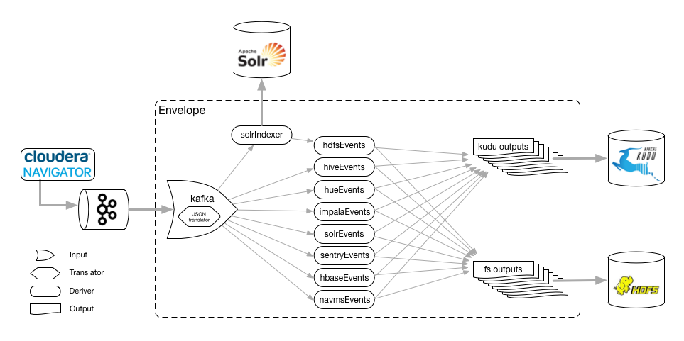

# Navigator Audit example

Cloudera Navigator Audit is a tool that collects and consolidates audit records from several Hadoop services. It offers the ability to forward those events into a Kafka topic for downstream consumption.

This example reads audit events from a Kafka topic populated by Navigator Audit and writes them to Kudu and Solr. We have also added a HDFS filesystem output for the sake of showing how to handle writes to table partitions on HDFS, but this option comes with caveats (see link:#caveats-of-using-parquet-tables[below]).

The Envelope workflow implemented in this example looks like the following:

.Navigator Audit example

Audit events are written to Kafka by Navigator Audit as JSON strings. The envelope pipeline reads this payload through a Kafka input, which uses an embedded Morphlines translator to convert the JSON messages into Dataset records.

These records are then processed by Envelope derivers, which filter the records for each particular Hadoop service, and the results are forward to the corresponding outputs (Kudu and Filesystem). The `solrIndexer` deriver is used to index the audit records, using a Morphline to send the events to Solr. This enables searching of the audit events through Solr queries, besides using Impala to queries the data in Kudu and/or HDFS.

Derivers in Envelope must be chained to an Envelope output for them to the processed. If there's no path between a deriver and an output step, the deriver is simply not executed. Hence, the `solrIndexer` deriver is connected to the `hdfsEvents` deriver to ensure it is executed to send the audit records to Solr. The output of the `solrIndexer` deriver is similar to that of the Kafka input, so the `hdfsEvents` deriver is not affected at all. All the other derivers read directly from the Kafka input for efficiency.

## Security

### Authentication

This example also demonstrates the necessary configuration to run the Envelope job against a secured cluster. It contains all the required configurations to properly authenticate with Kerbero-enabled clusters.

If you're running the example against a non-secured cluster, you will have to adjust the following Kafka setting in the configuration file:

* `parameter.security.protocol = SSL` (if TLS is enabled)
* `parameter.security.protocol = PLAINTEXT` (if TLS is *not* enabled)

### Authorization

If authorization has been configured for your cluster you must ensure that the following privileges have been granted to the user who's running the Envelope job:

* Read privileges on the Kafka topic containing the audit events
* Write privileges on the Solr collection where the messages will be indexed
* Select and insert privileges on the Kudu table used for Kafka offset management
* Insert privileges on the output Kudu tables (for the Kudu outputs)
* Read and write permissions on the output HDFS directories (for the HDFS Filesystem outputs)

### Encryption

The example has been configured for a Kafka cluster with TLS encryption enabled. To run it successfully you will need a copy of the JKS truststore for the Kafka cluster, as well as the truststore password, which should be configured in the job configuration file.

If TLS is not being used for Kafka you need to adjust the following settings in the configuration file:

* `parameter.security.protocol = SASL_PLAINTEXT` (if Kerberos is enabled)
* `parameter.security.protocol = PLAINTEXT` (if Kerberos is *not* enabled)

## Running the example

. Create a directory for the Parquet tables, if it doesn't already exist.

    hdfs dfs -mkdir -p hdfs:///data/nav
+
Ensure the following permissions have been granted on this directory:

* Read/write permissions for the user running the Envelope job
* Read/write permissions for the `hive` group

. Create the required Kudu and Parquet tables using the provided Apache Impala script:

    impala-shell -f create_nav_tables.sql \
      --var hdfs_base_dir=hdfs:///data/nav \
      --verbose

. Create partitions for the Kudu tables:

    ./add_kudu_partitions.sh > create_partitions.sql
    impala-shell --verbose -f create_partitions.sql

. Create the required Kafka topic:

    kafka-topics --zookeeper YOURZOOKEEPERHOSTNAME:2181 --create --topic nav-audit --partitions 4 --replication-factor 3

. Configure Cloudera Navigator Audit to link:https://www.cloudera.com/documentation/enterprise/latest/topics/cn_admcfg_audit_publish.html#concept_bpk_rfc_dt__section_t5g_42c_dt[publish audit events to Kafka].

. _If running in a secured cluster_, link:https://www.cloudera.com/documentation/enterprise/latest/topics/cdh_sg_kadmin_kerberos_keytab.html[create a keytab file] for the Kerberos principal that will run the example job. Ensure that the permissions of the keytab file are set to `400`.

. From a host that has been configured as a Solr client (i.e. has the `solrctl` binary and the `/etc/solr/conf` client configuration files), run the script below. This script will create a new Solr collection to receive the audit records. By default the collection will be called `nav-audit` and will have 3 shards. These settings can be changed by changing the values of the `COLLECTION_NAME` and `NUM_SHARDS` variables in the script, respectively.

    ./solr-setup.sh

. _If running in a secured cluster_, modify `jaas.conf` to set the correct values for the `keyTab` and `principal` properties. Note that `KEYTABFILENAME` should be just the file name, **not** the full path.

. Modify `nav-morphline.conf` to update the `zkHost` property to point to your ZooKeeper ensemble. If you changed the Solr collection name in step 6 above, you should also update the `collection` property to reflect the new name.

. Modify `nav-audit.conf`, reviewing all the properties in the `vars` section and updating them as per your environment.

. _If running in a secured cluster_, modify `submit.sh` to update the `KERBEROS_KEYTAB` and `KERBEROS_PRINCIPAL` variables.

. Run the example by submitting the Envelope application using the provided wrapper script:

* For secured clusters:

    ./submit.sh

* For unsecured clusters:

    ./submit-unsecure.sh

## Architecture

In this section we go into a bit more details of the implementation of this example.

### Audit records

The audit records written by Navigator Audit to the Kafka topic are JSON-formatted string containing the attributes of each audit event. The events for all service types share a common set of attributes and each service has additional specific attributes, as shown in the table below. The mapping between the JSON attributes and Impala table columns is also shown below.

[%autowidth,cols="1,1,1,1"]
|====
|Service|JSON Attribute|Table column|Comments

.7+|Generic
|service|service_name|
|allowed|allowed|
|user|username|
|impersonator|impersonator|
|ip|ip_addr|
|time|event_time|
|op|operation|

.3+|HBase
|tableName|table_name|
|family|family|
|qualifier|qualifier|

.4+|HDFS
|src|src|
|dst|dest|
|perms|permissions|
|DELEGATION_TOKEN_ID|delegation_token_id|Not exposed through the Kafka messages

.6+|Hive
|opText|operation_text|
|db|database_name|
|table|table_name|
|path|resource_path|
|objType|object_type|
|objUsageType|object_usage_type|

.3+|Hue
|operationText|operation_text|
|service|service|
|url|url|

.8+|Impala
|opText|operation_text|
|status|status|
|db|database_name|
|table|table_name|
|privilege|privilege|
|objType|object_type|
|QUERY_ID|query_id
.2+|Not exposed through the Kafka messages
|SESSION_ID|session_id

.4+|NavMS
|additionalInfo|additional_info|
|entityId|entity_id|
|name|stored_object_name|
|subOperation|sub_operation|

.5+|Sentry
|databaseName|sentry_database_name|
|objectType|sentry_object_type|
|operationText|operation_text|
|resourcePath|resource_path|
|tableName|table_name|

.3+|Solr
|collectionName|collection_name|
|operationParams|operation_params|
|solrVersion|solr_version|

|====

### Kafka Input

An Envelope's Kafka input is used to read the Navigator Audit events from the Kafka topic. A translator is required to convert these event JSON strings into actual records to be processed by the pipeline.

A Morphline translator is associated to the Kafka input to perform this translation. A single Morphline is used for all the types of audit event. This Morphline uses the superset of all JSON event attributes (listed in the table above), and ignores any attributes not found in the event being processed. The output of the input step is a record with fields named after the JSON attributes.

#### Offset management

To enable the job to be stopped and restarted, the Kafka input step manages the Kafka message offsets by storing them in a Kudu table (`impala::nav.nav_offsets`). The offsets are committed to this table only after the associated records have been persisted to the job output. With this, if the job is stopped in the middle of a micro-batch, when it is restarted it will reprocess any messages that had not been written at the end of the pipeline. This implements _at-least-once_ delivery semantics.

### Event derivers

The stream of records that come out of the Kafka input step contain all the 8 type of events that Navigator Audit captures. The attribute `type` of the audit event records identify which service they are coming from.

The goal of this Envelope pipeline is to separate the events by service type and store them in service-specific tables/directories. To filter the records for each service we use SQL derivers, which use a SQL query, like the one in the example below, to filter all the events for a particular service.

[source,sql]
----
SELECT
  -- partitioning column
  from_unixtime(time/1000, 'yyyy-MM-dd') as day,
  -- generic attributes
  service as service_name, allowed as allowed, user as username,
  impersonator as impersonator, ip as ip_addr, time as event_time, op as operation,
  -- event specific attributes
  src as src, dst as dest, perms as permissions,
  -- the attribute below is not exposed by Navigator through Kafka;
  -- it's included here for completeness sake only
  DELEGATION_TOKEN_ID as delegation_token_id
FROM solrIndexerDeriver
WHERE type = 'HDFS'
----

All the tables created in this example are partitioned by day. Since the original audit events don't have a `day` column we have to generate one, deriving it from the event `time` value. The query then lists all the generic event attributes, followed by the ones specific to the event associated with the deriver where the query is configured. Note that the query's `WHERE` clause filters only the events associated with that particular service.

Some attributes that exist in Navigator Audit, such as the `DELEGATION_TOKEN_ID` listed above, are not added to the messages written to Kafka. I could have removed these attributes altogether from the example, but decided to leave them in just for completeness.

### Solr indexer deriver

As you may have noticed in the query above, the stream of records selected for the HDFS service come from the `solrIndexerDeriver`, rather than the `kafkaInput`, which is the source for all the other 7 event derivers.

The reason for that is that the `solrIndexerDeriver` is only executed if it's connected, directly or indirectly, to an Envelope output. Hence, to enable the indexing of records in Solr, we replaced the input of one of the derivers, which by chance happens to be the HDFS deriver, with the `solrIndexerDeriver`. The output of this deriver contains all the attributes that exist in the Kafka input's output.

This deriver is a very simple Morphline deriver. Besides sending the audit event records to Solr for indexing the Morphline only adds two fields of information to the record:

* `id` - a mandatory unique identifier, which is built as the concatenation of the `time`, `service` and `ip` fields.
* `timeStr` - a formatted date/time string representation of the `time` field, which contains the time of the event in link:https://en.wikipedia.org/wiki/Unix_time[Unix Epoch time] format (in milliseconds).

Each deriver is then used as a source in two independent outputs: a Kudu output and a (HDFS) filesystem output, which are explained below.

### Kudu outputs

Kudu is our recommended output for this example. It provides a efficient and easy way to store and query audit records at scale. The configuration of the Kudu outputs is fairly straight forward. Those outputs have been configured with `insert.ignore = true` to allow records to be _upserted_ in case a restart of the job causes an event to be reprocessed.

#### Managing partitions for Kudu tables

The Kudu tables used in this example are (range) partitioned by day, and each day partitioned is further partitioned in multiple hash buckets, for performance. This increases parallelism and makes it faster to query events for a particular day.

The caveat is that the range partitions must already exist when event for particular days are ingested. If the partition does exist the job will fail to populate the Kudu tables.

We have included a script to help create partitions for all the Kudu tables. The script generates a DDL script, which can then be executed using `impala-shell`. The syntax of the script is:

.Syntax of add_kudu_partitions.sh
[source,shell]
----
./add_kudu_partitions.sh [#_of_days] [start_day]
----

Both parameters are optional. If they are omitted, the script will generate DDL statements to create partitions for 7 days, starting from the current day. You can control the range of partitions and the starting point by specifying the parameters.

.Usage example of add_kudu_partitions.sh
[source,shell]
----
# Default usage
$ ./add_kudu_partitions.sh
ALTER TABLE nav.hbase_events_kudu ADD IF NOT EXISTS RANGE PARTITION VALUE = '2018-06-02';
...
ALTER TABLE nav.hbase_events_kudu ADD IF NOT EXISTS RANGE PARTITION VALUE = '2018-06-08';
ALTER TABLE nav.hdfs_events_kudu ADD IF NOT EXISTS RANGE PARTITION VALUE = '2018-06-02';
...
ALTER TABLE nav.hdfs_events_kudu ADD IF NOT EXISTS RANGE PARTITION VALUE = '2018-06-08';
...

# Specifying a different date range
$ ./add_kudu_partitions.sh 5 2018-05-30
ALTER TABLE nav.hbase_events_kudu ADD IF NOT EXISTS RANGE PARTITION VALUE = '2018-05-30';
...
ALTER TABLE nav.hbase_events_kudu ADD IF NOT EXISTS RANGE PARTITION VALUE = '2018-06-03';
ALTER TABLE nav.hdfs_events_kudu ADD IF NOT EXISTS RANGE PARTITION VALUE = '2018-05-30';
...
ALTER TABLE nav.hdfs_events_kudu ADD IF NOT EXISTS RANGE PARTITION VALUE = '2018-06-03';
...

# Generate DDL and execute with impala-shell
$ ./add_kudu_partitions.sh 5 2018-05-30 > create_partitions.sql
$ impala-shell -v -f create_partitions.sql

----

### Filesystem outputs

For the sake of showing an example of writing to partitioned Impala Parquet-based tables, we have also added Filesystem outputs to this example, besides the Kudu ones.

Although this might be a cheaper alternative for longer-term storage of the audit events, the implementation in this example is *not recommended for production* and is here for the mere purpose of illustrating the usage of the filesystem output.

Writing to HDFS-based tables using short microbatches, as the one in this example, _has the potential of creating too many small Parquet files on HDFS_, which will be detrimental to the Impala and HDFS performances in the long run.

A better approach for long-term storage of events in HDFS would be the creation of a separate Envelope job that runs less frequently (once a day, for example), and copy older partitions of the Kudu table to HDFS. This implementation, though, is out of the scope of this example.

#### Managing partitions and refreshes for Impala tables

Differently from the Kudu tables, HDFS partition directories will be automatically created every time the first event for a new day is ingested. There's no need to precreate the directories in advance.

The new directories/partitions, however, will *not* be immediately visible for users querying the Impala tables. Similarly, new Parquet files added to partitions will not be visible by Impala users until a `REFRESH` is executed for the table.

Hence, you must schedule the following statements

[source,sql]
----
ALTER TABLE <table_name> RECOVER PARTITIONS;
REFRESH <table_name>;
----

This example provides a DDL script with these commands for all the Parquet tables, which can be run with the following command:

[source,shell]
----
impala-shell -v -f refresh_parquet_tables.sql
----

## Querying data through Impala

[source,shell]
----
[host1:21000] > select * from nav.hdfs_events limit 3;
...
+------------+---------------+--------------+----------+--------------+-------------+---------+--------------+-----------------------------------------------------------------------------------------------+------+-------------+---------------------+
| day        | event_time    | service_name | username | ip_addr      | operation   | allowed | impersonator | src                                                                                           | dest | permissions | delegation_token_id |
+------------+---------------+--------------+----------+--------------+-------------+---------+--------------+-----------------------------------------------------------------------------------------------+------+-------------+---------------------+
| 2018-06-03 | 1528086332427 | HDFS-1       | root     | 172.31.116.6 | getfileinfo | true    | NULL         | /data/nav/navms_events_parquet/_temporary/0/_temporary/attempt_20180603212532_0012_m_000000_0 | NULL | NULL        | NULL                |
| 2018-06-03 | 1528086332680 | HDFS-1       | root     | 172.31.116.9 | delete      | true    | NULL         | /data/nav/navms_events_parquet/_temporary                                                     | NULL | NULL        | NULL                |
| 2018-06-03 | 1528086344032 | HDFS-1       | root     | 172.31.116.6 | getfileinfo | true    | NULL         | /data/nav/hdfs_events_parquet/_temporary/0/_temporary/attempt_20180603212544_0014_m_000002_0  | NULL | NULL        | NULL                |
+------------+---------------+--------------+----------+--------------+-------------+---------+--------------+-----------------------------------------------------------------------------------------------+------+-------------+---------------------+
Fetched 3 row(s) in 0.34s
----

## Querying data through Solr

[source,shell]
----
$ curl "http://solr1.example.com:8983/solr/nav-audit_shard2_replica1/select?q=(time:1528086321905)&wt=json&indent=true"
{
  "responseHeader":{
    "status":0,
    "QTime":20,
    "params":{
      "q":"(time:1528086321905)",
      "indent":"true",
      "wt":"json"}},
  "response":{"numFound":1,"start":0,"maxScore":6.4875593,"docs":[
      {
        "allowed":"true",
        "timeStr":"2018-06-04T04:25:21.905Z",
        "type":"HDFS",
        "id":"1528086321905_HDFS-1_172.31.116.9",
        "ip":"172.31.116.9",
        "op":"listStatus",
        "src":"/data/nav/sentry_events_parquet/_temporary",
        "service":"HDFS-1",
        "time":"1528086321905",
        "user":"root",
        "_version_":1602314700517801984}]
  }}
----
